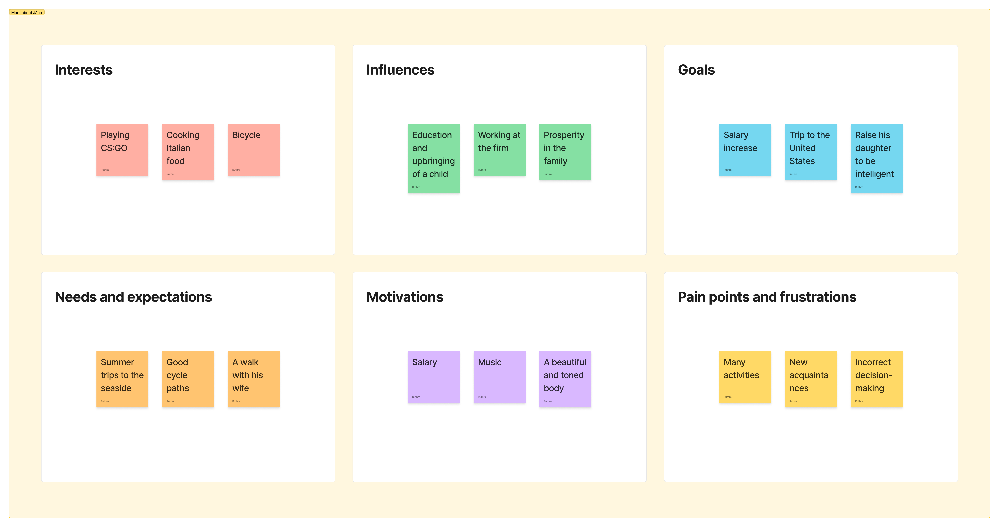

# Area Campfire

## Overview

**Pocket realtor** is a data-driven platform designed to help people make quick and confident property decisions when buying or renting. Rather than relying on biased property advertisements and seller interests, our service provides objective analysis of urban environments to match properties with users' lifestyle preferences and needs.

The platform combines interactive mapping technology with AI-powered natural language processing to transform property hunting from a weeks-long research process into an intuitive, data-backed experience.

---

## Problem Statement

There is **Jáno**, a 27-year-old frontend developer living in Košice with a wife and daughter. He's trying to buy a flat near a school with clean air so my daughter can walk in the fresh air, but he is afraid of making important decisions, such as buying a house, because he knows there are a lot of them and I may be mistaken, which makes him feel unconfident.

### Core Challenge
When searching for a property, potential buyers and renters face several critical pain points:

- **Information Overload**: Researching the quality of an area requires weeks of work and consultation with dozens of sources
- **Biased Information**: Property information is often distorted by sellers' interests and motivations
- **Urban Complexity**: It's unclear whether schools are nearby, how children will get there, or if the neighborhood provides clean air and safe walking routes
- **Lack of Confidence**: Fear of making incorrect decisions due to incomplete or unreliable information
- **Decision Paralysis**: Too many considerations, but inadequate integrated tools to evaluate them

### Market Context
According to [Slovakia's Housing Policy 2030](https://www.mindop.sk/fileadmin/documents/vystavba/bytovapolitika/dokumenty/koncepcie/Housing_policy_2030.pdf), the country faces significant housing challenges including physical housing shortage, low availability of rental housing, and deteriorating financial affordability. Between 2020 and 2040, Slovakia expects population growth concentrated in metropolitan regions (averaging 7% growth), intensifying the need for efficient housing search tools.

---

## Solution

### Description
The service helps people looking to buy or rent property to make quick and confident decisions based not on advertisements, but on the actual quality of the urban environment.
### Essence
On an interactive map, users can see heat layers: schools, ecology, building density, transport accessibility, and other indicators for the area. This allows them to immediately understand whether the place is suitable for their lifestyle.
 If the user does not know what to look for, they describe the conditions for a comfortable life by voice or text — the built-in assistant translates this into criteria and suggests relevant areas and properties.
## Competitive Positioning
Our solution stands out from competitors because it focuses on the European market, which still lacks an integrated tool of this kind, while similar products exist mainly for the US and Canada ([LIVABILITY](https://livability.com/), [areavibes](https://www.areavibes.com/), [MASHVISOR](https://www.mashvisor.com/)). Unlike those products, we put a strong emphasis on visual analytics: our heat maps use colors to show proximity to schools, cultural venues, public transport, as well as environmental conditions and other key urban factors.
## Data sources
- [City open data portal (base urban datasets)](https://opendata.kosice.sk/datasets/12aa132c31c447a2b3ded177ab5a271c/explore?location=48.719877%2C21.255718%2C20.61)
- [Detailed housing dataset](https://opendata.kosice.sk/datasets/2c560bd229914d2ea566f611ff8fa389_0/explore?location=48.698999%2C21.225828%2C16.56)
- [Public transport stops](https://opendata.kosice.sk/maps/027eaebb18144e8c9eecbf04a8ff4093)
- [Secondary schools](https://opendata.kosice.sk/datasets/73405066f5ac4461b8527936cc0af108_0/explore?location=48.698849%2C21.235876%2C15.49)
- [Primary schools](https://opendata.kosice.sk/datasets/75100f5ad049405c845396db6ae7c070_0/explore?location=48.698832%2C21.212367%2C12.84)
- [Cultural institutions](https://opendata.kosice.sk/datasets/34a04ba612bb47af9e1442fd6ce1cf2d_0/explore?location=48.731038%2C21.249161%2C15.84)
- [City districts (Mestské časti)](https://opendata.kosice.sk/datasets/37cb4912369c422083fd206450de5a71_0/explore?location=48.728461%2C21.257374%2C13.86)
- [Social services providers](https://opendata.kosice.sk/datasets/e110dd1d5cc84473b524ed260a3b7f65_0/explore?location=48.716527%2C21.248957%2C15.69)
- [Dog runs in Košice](https://opendata.kosice.sk/datasets/c7fdd02f76f047bca41fd74591866491_0/explore?location=48.716433%2C21.258698%2C13.63)

## Alignment with Megatrends
1. **AI-Enhanced Decision Making**: Our solution exemplifies AI making difficult work easier and safer—property research becomes accessible to non-experts
2. **Environmental Efficiency**: Reduces wasteful searches and unnecessary property visits by providing immediate, verified statistics
3. **Urban Density Challenge**: As cities become overcrowded, users need rapid, confident housing decisions
4. **Trust & Verification**: Combats rising AI fraud by exclusively using official, verifiable data sources
5. **Voice-First Interfaces**: Natural language interaction removes barriers to platform adoption
